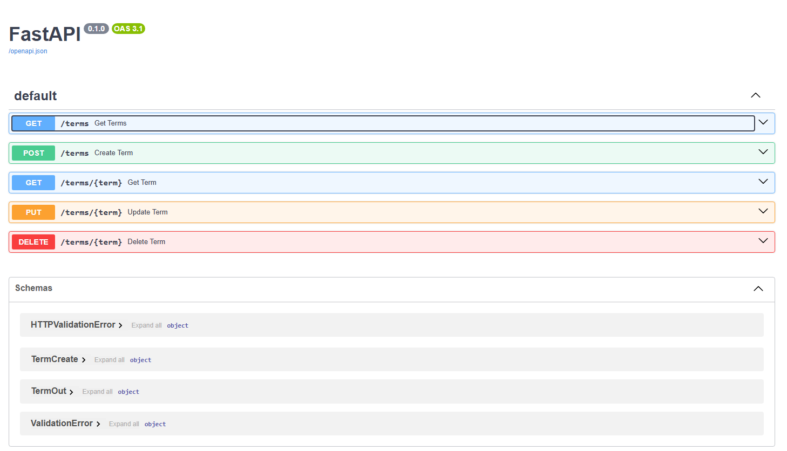

# REST. FastAPI. Swagger

Для создания контейнера приложения представлен Dockerfile:

```
FROM python:3.11-slim

WORKDIR /app
COPY requirements.txt .
RUN pip install --no-cache-dir -r requirements.txt

COPY ./app /app

CMD ["uvicorn", "app.main:app", "--host", "0.0.0.0", "--port", "8000"]
```

Для запуска контейнера docker-compose:

``` 
services:
  app:
    build:
      context: .
      dockerfile: Dockerfile
    ports:
      - "8000:8000"
    volumes:
      - .:/app
    command: uvicorn app.main:app --host 0.0.0.0 --port 8000 --reload
```

## Для запуска проекта необходимо

Собрать и запустить контейнеры:
```bash
docker-compose up --build
```
OpenApi будет доступно по адресу:

```bash
http://localhost:8000/docs
```
